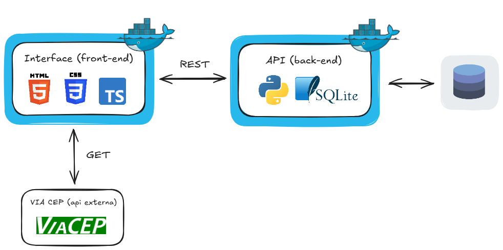

# entendedor-interface

Interface (front-end) do MVP da Sprint 3 (Arquitetura de Software) da Pós-Graduação em Engenharia de Software PUC-RIO (EntendeDor)

## ℹ️ Descrição

Sistema para acompanhamento e controle de sintomas de pessoas que sofrem de condições crônicas de saúde. Através dele é possível manter um histórico de registro da dor, dos eventos e de outros sintomas que atravessam o dia-a-dia para que seja possível acompanhar a evolução da condição e suas respostas à tratamentos e aos afazeres da rotina.

## 📐 Arquitetura

A arquitetura do projeto é baseada no cenário 1 sendo composta por três componentes:

1) Interface (front-end) 
Construída com HTML, CSS e TypeScript

2) API Externa (ViaCEP) 
API [ViaCEP](https://viacep.com.br/) utilizada para pegar o endereço automaticamente durante o cadastro de usuário via método get que retorna um JSON (exemplo: viacep.com.br/ws/01001000/json)

3) API (back-end) 
Construída com Python (flask, openapi e sqlalchemy) e SQLIte

## 🛠️ Instalação

1. Clone o repositório: 
   `git clone https://github.com/carlosedcec/entendedor-interface`

2. Certifique-se de ter o [Docker](https://docs.docker.com/engine/install/) instalado e em execução em sua máquina.

3. Configure e execute a [aplicação python](https://github.com/carlosedcec/entendedor-api) para subir o servidor.

4. Caso ainda não tenha criado, crie uma docker network para que os containers possam comunicar-se entre si **executando como administrador** o seguinte comando:

    `docker network create entendedor-net`

5. Navegue até o diretório raiz do entendedor-interface que contém o Dockerfile e **execute como administrador** o seguinte comando para construir a imagem Docker:

    `docker build -t entendedor-interface .`

6. Em seguida, execute o seguinte comando para rodar um container a partir da imagem gerada:

    `docker run -p 80:80 --network entendedor-net -d entendedor-interface`

7. Pronto, agora basta acessar [http://localhost](http://localhost) para ter acesso à aplicação.
